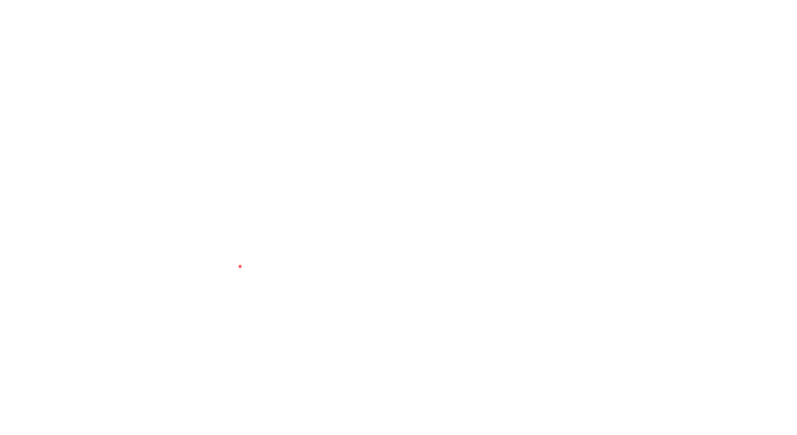

# 🚀 Side Cache (Lazy Loading) — Production-Grade System

### Amazon RDS + ElastiCache (Redis) | Flask | AWS Architecture

---

## 🧠 Overview

A **high-performance, production-ready caching layer** built using:

* **Amazon RDS (PostgreSQL)** → source of truth
* **ElastiCache (Redis)** → ultra-fast cache
* **Flask (Python)** → backend API
* **AWS VPC Architecture** → secure & scalable infra

> ⚡ Achieves **~80x performance improvement** using cache HIT vs MISS

---

## 🏗️ Architecture


> ⚡ Implements **Cache-Aside (Lazy Loading Pattern)** for optimized read performance

### 🔁 Cache-Aside (Lazy Loading) Flow

```text
1. Client request → EC2
2. EC2 checks Redis (GET)
   → HIT → return response (~3ms)
   → MISS → query RDS (~250ms)
3. Store result in Redis (SET)
4. Return response to user

### Key Design Decisions

* Private subnets for app, DB, and cache
* ALB for HTTPS termination
* Redis cluster mode for scalability
* RDS Multi-AZ for fault tolerance

---

## 🔐 Security Highlights

* No public access to RDS or Redis
* Security Group-based communication
* Secrets stored in AWS Secrets Manager
* TLS enforced for all services
* IAM roles with least privilege

---

## ⚙️ Tech Stack

| Layer    | Technology          |
| -------- | ------------------- |
| Backend  | Flask + Gunicorn    |
| Database | PostgreSQL (RDS)    |
| Cache    | Redis (ElastiCache) |
| Infra    | AWS (VPC, EC2)      |

---

## 📂 Project Structure

```text
ecommerce_cache/
├── app.py
├── cache_manager.py
├── db_manager.py
├── product_service.py
├── config.py
├── schema.sql
├── requirements.txt
```

---

## ⚡ How Caching Works

```text
1. Request comes → GET /products/{id}
2. Check Redis
   → HIT → return in ~3ms
   → MISS → fetch from RDS (~250ms)
3. Store in Redis with TTL
```

---

## 🧪 Performance Benchmark

```text
MISS  → ~250 ms
HIT   → ~3 ms
Speed → ~80x faster
```

---

## 🧩 Cache Strategy

| Data Type | TTL    |
| --------- | ------ |
| Product   | 30 min |
| Category  | 5 min  |
| Search    | 1 min  |
| Inventory | 30 sec |

### Anti-Stampede Protection

* TTL jitter added
* Optional Redis locking

---

## 🔄 Cache Invalidation

```text
Update flow:
1. Update DB
2. Delete cache key
3. Next request repopulates cache
```

---

## 📈 Scaling Strategy

* Vertical → upgrade Redis instance
* Horizontal → shard Redis cluster
* Add RDS read replicas

---

## 🛠️ Setup (Quick)

```bash
git clone <repo>
cd ecommerce_cache
pip install -r requirements.txt
python app.py
```

---

## 💡 Why This Project Matters

This is not a toy project.

It demonstrates:

* Real-world caching patterns
* AWS production architecture
* Performance engineering mindset
* Backend + infra integration

---

## 🧠 Key Learnings

* Cache is not optional at scale
* DB should never handle all reads
* TTL design is critical
* Security matters as much as performance

---

## 📌 Future Improvements

* Add CDN layer (CloudFront)
* Implement write-through caching
* Add rate limiting
* Observability (Prometheus + Grafana)

---

## 👨‍💻 Author

**Sahas**
Computer Engineering Student | Backend + Cloud Enthusiast

---

## ⭐ If this helped you

Give it a star ⭐ — or fork and build your own version.
